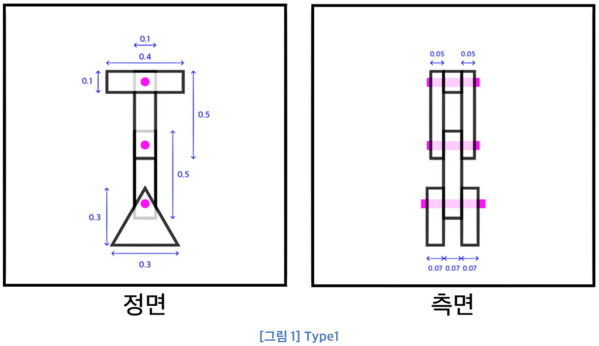
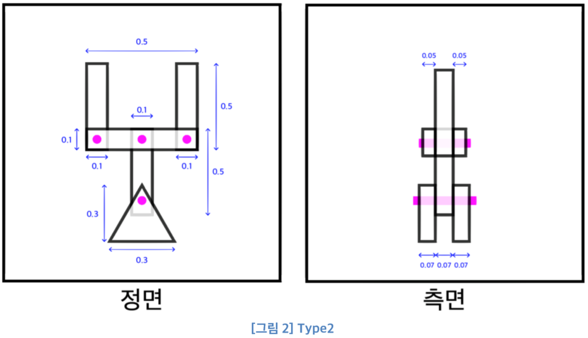

# Graphics2-2
Graphics2 Homework2: Simple Robot Arm

---

### 전역변수
전역변수에는 스페이스바를 누를 때 마다 로봇의 팔이 회전하고 멈추게 제어할 <b>bRotate</b>가 false상태로 초기화된다.  
1키와 2키를 누를 때 마다 로봇의 타입을 바꿀때 사용할 int 형의 type변수를 초기값 1로 설정한다.  
로봇이 지속적으로 Y축 회전하기 때문에 이를 위해 float형 <b>time</b> 변수를 0.0으로 초기화한다.  
<b>rotate</b>는 앞의 bRotate에 따라서 로봇의 팔을 회전시킬 각도를 저장하고  
<b>ang1, ang2, ang3</b>은 로봇 팔의 각각 파트별 각도를 삼각함수를 이용해서 저장하기 위한 변수이다.  

### myDisplay  
myDisplay 함수에서 조건문을 통해 type이 1일때는 draw1 함수를, type이 2일때는 draw2 함수를 불러서  
type에 따라 다른 형태의 로봇을 그린다.  

### Draw1  
  
Draw1 은 Type1의 로봇을 그린다. 로봇의 크기와 형태는 [그림 1]과 같다.  
Deque인 MS를 이용해 CTM을 쌓아놓는다.  
mat4형식의 CTM은 움직일 위치 (대부분은 조인트가 심어지는 위치)를 저장하고,  
mat4형식의 M에 로봇 팔의 각각 파트별 모양을 저장한다.  
맨 처음에는 로봇을 화면 중앙부분에 그리고 Y축으로 계속 회전시키기 위해  
CTM에 (time＊5)만큼 Y축회전과 (-0.5)만큼 Y축으로 이동을 저장한다.  
(여기서 실제 코드상 순서는 CTM = 이동＊회전이다. 이하 생략)  
이 회전과 이동은 이후에 그릴 파트에도 향을 준다. 그 뒤 M을 이용해 <b>base_left</b> 파트와 <b>base_right</b>파트를 그린다.  
(실제로는 왼쪽/오른쪽이 아니라 앞/뒤지만 편의상 이름을 이렇게 지었다.)  
이 두 부분의 회전은 가운데 중심 축인 Y축을 기준으로 회전하기 때문에  
CTM이 아닌 M에서 Z축방향으로 (0.07)씩 서로 띄워준다.  
조인트 또한 M에서 크기와 위치를 정한 뒤 그려준다.  
조인트는 base의 윗부분에 있으므로 Y축으로 (0.1)만큼 이동시켰다.  
또한 맨 첫부분 이외에는 위치를 저장할 필요가 없기 때문에 CTM은 처음부분에서 한번만 저장한다.  
이는 뒷부분도 마찬가지인데,  
base의 왼쪽과 오른쪽의 Z축이동을 각각 CTM에 저장하고 MS에 push, pop해도 되지만  
이렇게 되면 기준점이 왔다갔다 움직이기 때문에 맨 처음 base부분과 조인트의 위치 (회전할 위치)만 담았다.  
또한 조인트를 잘 보면 자신이 속해있는 부분의 회전에 따라서 움직인다.  
코드상 CTM과 조인트를 따로 구분한것은 조인트가 다음 파트의 회전에 영향을 받지 않게 하기 위해서이다.  
CTM을 필요한 부분에서만 했으므로 MS에 push하는 것 또한 CTM을 변경한 부분에서만 한다.  
다음으로는 <b>UpperArm</b>을 그린다.  
이 부분에서 Z축으로 회전이 있어야 하며 이전의 CTM이 화면의 아랫부분, base의 가운데이기 때문에 위로 올려야한다.  
따라서 CTM에 (ang1)만큼 Z축회전과 (0.1)만큼 Y축으로 이동을 저장한다.  
M 을 이용해 UpperArm파트의 모양을 그리는데, 이 때 회전이 아랫부분에서 일어나므로 (0.2)만큼 Y축으로 이동시킨다.  
이렇게 하면 파트의 아랫부분을 기준으로 회전이 일어난다.  
(기본적으로 아무 이동없이 회전시키면 물체의 가운데를 기점으로 회전한다.)  
이때 끝까지 올리지 않고 약간 남기고 올리는 이유는  
조인트가(회전할 축이) 파트를 벗어난 아랫부분이 아닌 Upper Arm의 약간 안쪽에 있기 때문이다.  
M을 이용해 다음부분과 이어질 조인트를 그린다.  
이 또한 파트의 약간 안쪽(Upper Arm과 LowerArm이 겹쳐지는 부분)에 있기 때문에 Y축으로 (0.4)만큼만 이동시켰다.  
<b>LowerArm</b> 부분의 CTM은 Z축으로 (ang2)만큼 회전한 뒤  
앞에서 UpperArm과 이어질 조인트와 마찬가지로 Y축으로 (0.4)만큼 이동시킨다.  
또한 base와 마찬가지로 Lower_left, Lower_right는  M에서 Z축으로 서로 (0.06)만큼 띄워준다.  
조인트는 Hand와 겹쳐지도록 Y축으로 (0.4)만큼만 이동시킨다.  
<b>Hand</b>는 CTM에서 Z축으로 (ang3)만큼 회전하고 Y축으로 (0.4) 이동하고 M을 이용해 모양을 그려준다.  

### Draw2  
  
Draw2는 Type2의 로봇을 그린다. 로봇의 크기와 형태는 [그림 2]와 같다.  
UpperArm까지는 Draw1의 Type1로봇과 동일하다.  
<b>LowerArm</b> 에서 Type1과 다른 점은 조인트와 Hand가 양옆에 붙어있다는 점이다.  
우선 앞에서 처럼 M을 이용해 조인트를 X 축으로 띄워 양 옆에 그려준다.  
<b>Hand</b>에서 CTM을 왼쪽과 오른쪽으로 나눠서 그린다.  
Hand_left를 그릴 때는 CTM에서 Z축으로 (ang3)만큼 회전하고 X축으로 (-0.2)만큼 이동한다.  
M을 이용해 모양을 그린 뒤 MS에 CTM을 push한다.  
Hand_right를 그릴 때는 CTM이 이전 단계로 돌아가야한다.  
MS에서 pop한뒤 CTM에 MS의 값 (이전 단계)를 저장한다.  
그러면  Hand_left의 CTM을 설정하기 바로 전이 되고,  
Hand_left와 반대로 회전하기 위해  
CTM에 Z축으로 (-ang3)만큼 회전, X축으로 (0.2)만큼 이동을 저장한다.  
마찬가지로 M을 이용해 모양을 그린다.  

### myIdle  
myIdle에서는 로봇 전체를 회전시킬때 필요한 값인 <b>time</b>을 0.1씩 계속 더한다.  
로봇의 팔은 bRotate가 true면 회전한다.  
<b>rotate</b>를 0.1씩 계속 더하고 로봇의 형태마다 회전할 각도가 다르기 때문에 중첩 조건문을 새로 만들어서  
Type이 1이면  ang1는 60도 내에서 (rotate＊0.5)의 속도로,  
ang2는 60도 내에서 (rotate)의 속도로, ang3은 20도 내에서 (rotate＊2)의 속도로 계산한다.  
Type2는 ang1는 60도 내에서 (rotate＊0.5)의 속도로,  
ang2는 20도 내에서 (rotate)의 속도로,  
ang3은 20도 내에서 (rotate)의 속도로 계산한다.  
time과 rotate를 따로 놓은 이유는  
Y축으로는 스페이스바를 누르던 말던 (bRotate가 true던 false던) 계속 회전하고,  
로봇 팔의 Z축 회전은 스페이스바를 누르면 회전을 시작하고 또누르면 멈추는데  
여기서 다시 누르면 이전 회전 각도에서 이어서 회전한다.  
따라서 별도의 변수가 필요하다고 판단해서 따로 놓았다.  

### myKey
myKey는 입력받은 키값에 따라 작동한다.  
스페이스바를 눌을 때 bRotate가 false면 true로 바꿔서 로봇의 팔을 회전 시킬 수 있도록 한다.  
다시 누르면 false로 만들어 회전을 멈춘다.  
<b>1키</b>를 누르면 type에 1을 저장하고, <b>2키</b>를 누르면 type에 2를 저장한다.  
그러면 앞의 myDisplay에서 조건문을 통해 판별하여 로봇을 그린다. 
